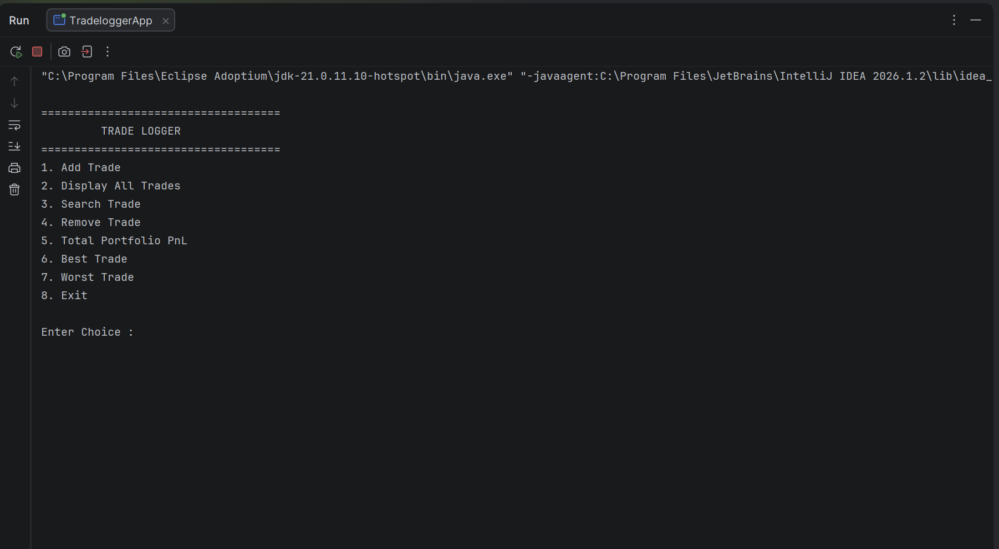
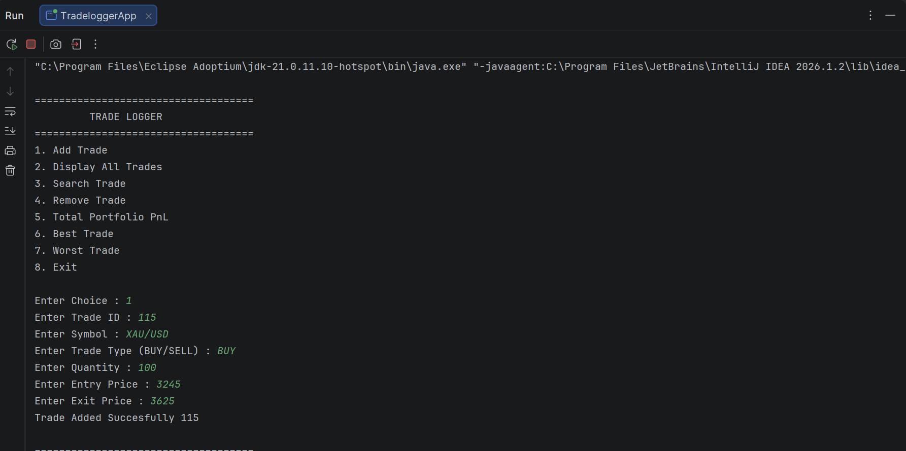
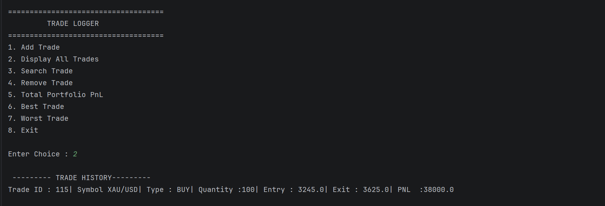
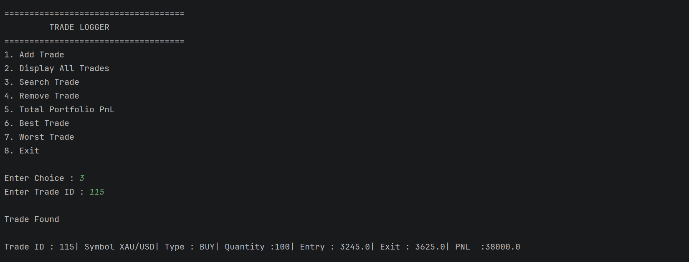
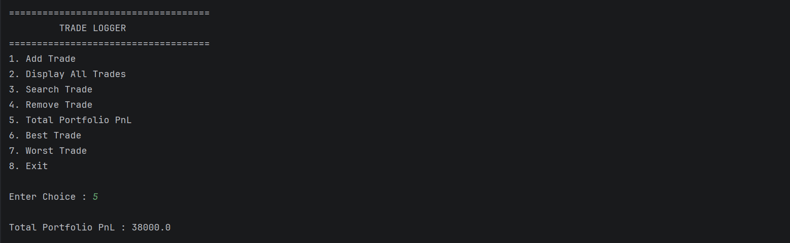

# 📈 Trade Logger

A **Core Java Console Application** that simulates a simple Trade Logging System. This project allows users to record BUY/SELL trades, calculate Profit & Loss (PnL), search trades, remove trades, and analyze the best and worst performing trades.

This project was built to strengthen **Java fundamentals, Object-Oriented Programming (OOP), Collections Framework (ArrayList), Enums, CRUD Operations, and Separation of Concerns**.

---

# 🚀 Features

- ✅ Add a Trade
- ✅ Display All Trades
- ✅ Search Trade by Trade ID
- ✅ Remove Trade
- ✅ Calculate Total Portfolio PnL
- ✅ Find Best Performing Trade
- ✅ Find Worst Performing Trade
- ✅ Console Menu Driven Application

---

# 🛠 Technologies Used

- Java
- IntelliJ IDEA
- Git
- GitHub

---

# 📂 Project Structure

```
10-Trade-Logger
│
├── src
│   ├── trade.java
│   ├── tradeservice.java
│   ├── TradeLoggerApp.java
│   └── TradeType.java
│
├── Add.png
├── Display.png
├── Home.png
├── PNL.png
├── Search.png
└── README.md
```

---

# 📚 Concepts Covered

## Core Java

- Classes & Objects
- Constructors
- Methods
- Getters
- Encapsulation
- Enums
- Scanner
- Switch Case
- ArrayList
- Loops
- Conditional Statements

## Object-Oriented Programming

- Abstraction
- Encapsulation
- Composition
- Object References
- Separation of Concerns

## Java Collections

- ArrayList
- CRUD Operations
- Searching
- Traversing Collections

---

# 📸 Screenshots

## 🏠 Home Menu



---

## ➕ Add Trade



---

## 📋 Display Trades



---

## 🔍 Search Trade



---

## 💰 Portfolio PnL



---

# 🧠 Learning Outcomes

Through this project I learned:

- Designing applications using OOP principles
- Working with ArrayList for data storage
- Creating reusable methods
- Implementing CRUD operations
- Searching objects using Linear Search
- Calculating business logic (Portfolio PnL)
- Using Enums for fixed constants
- Building menu-driven console applications
- Organizing code into multiple classes

---

# ▶️ How to Run

1. Clone the repository

```bash
git clone https://github.com/CoolMonkRJ/java-prep.git
```

2. Navigate to the project

```bash
cd java-prep/10-Trade-Logger
```

3. Open in IntelliJ IDEA

4. Run

```
TradeLoggerApp.java
```

---

# 📈 Future Improvements

- Store trades in a database
- Export trade history to CSV
- Import trades from CSV
- File persistence
- Spring Boot REST API
- MySQL Integration
- Authentication using JWT
- Trade Analytics Dashboard

---

# 👨‍💻 Author

**Rohit Jain**

GitHub: https://github.com/CoolMonkRJ

---

⭐ If you found this project helpful, consider giving the repository a star.
